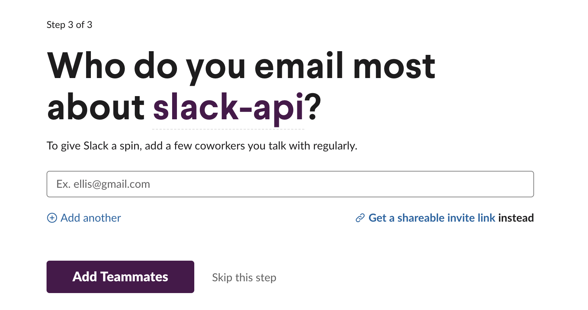

# Slack API の始め方をまとめました

## 目次
- SlackにAppを登録
- Slack App を作成
- Slack API を利用してメッセージを投稿する。

※ rubyを使用します

## SlackにAppを登録
ブラウザで次のページよりSlack APIにログインする。
https://slack.com/signin

### 開発用のワークスペースを作成

ログインを終えたら次のページより開発テスト用のワークスペースを作成する.


まずは、`+ Create a New Workspace` をクリック。


作成するワークスペースの名前を聞かれるので任意の名前を入力し、`Next`をクリック。
（作者は 『development』 という名前に設定）


次にワークスペースを利用する目的を聞かれるので任意のメッセージを入力し、`Next`をクリック。
（作者は 『slack api』 と記述）



次に招待するメンバーを聞かれるので、無視して`Skip this step`をクリック。


これでワークスペースの作成が完了。

### Slack App を作成する
#### 1. Slack App を作成する
ブラウザで次のページよりSlack Appを作成する。
https://api.slack.com/apps?new_app=1


**App Name**
アプリの名前を任意に入力
※ 後から変更可能

**Development Slack Workspace**
アプリを適用するワークスペース(先ほど作成した)を選択
※ 後から変更不可のため注意

入力・選択後`Create App`をクリック。

#### 2. ScopesでSlackアプリの権限を設定


`Permission`をクリックし移動


`Add an OAuth Scope`をクリックした後、`chat:write`を選択し、Scopeを追加する。
(chat:write)によりBotによる投稿が可能になる
※ 後から追加可能

#### 3. アプリをworkspaceにインストールする


Scopeを設定したページと同様のページにて、
`Install to Workspace`をクリックし、Slackアプリをワークスペースにインストール。


次の様なページが表示されるので`Allow`をクリック。
(ワークスペースないでアプリを実行して良いかを確認しています。)


これでワークスペースへのアプリのインストールが完了しました。
上記の`Bot User OAuth Access Token`は後で使用するのでメモ。

### Slack API を利用してメッセージを投稿する
#### 1. Gemfileを追加する
Gemfileを作成する
```ruby:Gemfile
source 'https://rubygems.org'

gem 'http'
gem 'json'
```
```
$ bundle install
```

#### 2. スクリプト実行用のファイルを用意する
```ruby:test.rb
require 'http'
require 'json'

BOT_USER_ACCESS_TOKEN="< 先ほどメモしたBot User OAuth Access Token をコピペ >"

response = HTTP.post("https://slack.com/api/chat.postMessage", params: {
  token: BOT_USER_ACCESS_TOKEN,
  channel: '#random',
  text: 'hello slack',
  as_user: true
  })
puts JSON.pretty_generate(JSON.parse(response.body))
```

**解説入り**
```ruby:test.rb
# Apiリクエスト送信に用いる
require 'http'
# Jsonデータ作成に用いる
require 'json'

# ACCESS_TOKENを設定
# Scopeへのアクセスに利用する
BOT_USER_ACCESS_TOKEN="< 先ほどメモしたBot User OAuth Access Token をコピペ >"

# HTTPリクエストを特定にSlackApiのURLに送信する
# chat.postMessage では投稿を作成する
# paramsの中身は指定された値を渡す
response = HTTP.post("https://slack.com/api/chat.postMessage", params: {
  token: BOT_USER_ACCESS_TOKEN,
  channel: '#random',
  text: 'hello slack',
  as_user: true
})
puts JSON.pretty_generate(JSON.parse(response.body))
```

**paramsの中身について**
<table>
  <tr>
    <td>token</td>
    <td>認証トークンを指定</td>
  </tr>
  <tr>
    <td>channel</td>
    <td>メッセージを投稿するチャンネルを指定</td>
  </tr>
  <tr>
    <td>text</td>
    <td>メッセージを指定</td>
  </tr>
  <tr>
    <td>as_user</td>
    <td>trueを渡すと認証されたユーザーとしてメッセージが投稿される</td>
  </tr>
</table>

詳しくはこちらのページに記載されています。
https://api.slack.com/methods/chat.postMessage

今回はメッセーを投稿するために`chat.postMessage`を用いましたが他にも様々なapiメソッドが用意されています。
https://api.slack.com/methods

#### Botをチャンネルに招待する


Apiによるメッセージの送信に用いるチャンネルのメッセージにて`/invite @<Bot_Name>`を入力し、Botをチャンネルに招待する。

#### 3. 実行
次のコマンドによりスクリプトを実行
```
$ bundle exec ruby test.rb
#=>
{
  "ok": true,
  "channel": "...",
  "ts": "...",
  "message": {
    "bot_id": "...",
    "type": "message",
    "text": "hello slack",
    "user": "...",
    "ts": "...",
    "team": "...",
    "bot_profile": {
      "id": "...",
      "deleted": false,
      "name": "test_app",
      "updated": ...,
      "app_id": "...",
      "icons": {
        "image_36": "https://a.slack-edge.com/80588/img/plugins/app/bot_36.png",
        "image_48": "https://a.slack-edge.com/80588/img/plugins/app/bot_48.png",
        "image_72": "https://a.slack-edge.com/80588/img/plugins/app/service_72.png"
      },
      "team_id": "..."
    }
  }
```
実行結果が上記のようになっていれば成功です！

Slackを確認してみましょう！


反映されていますね、これにて終了です。
お疲れ様でした :)

#### エラーについて
エラーについて簡単にまとめたので参考までに
<table>
  <tr>
    <td>channel_not_found</td>
    <td>チャンネルが存在しない</td>
  </tr>
  <tr>
    <td>not_authed</td>
    <td>認証トークンが設定されていない、もしくは間違っている</td>
  </tr>
  <tr>
    <td>missing_scope</td>
    <td>スコープ権限が正しく設定されていない</br>設定を変更したらreinstallが必要</td>
  </tr>
  <tr>
    <td>not_in_channel</td>
    <td>チャンネルにBotが追加されていない</td>
  </tr>
</table>
